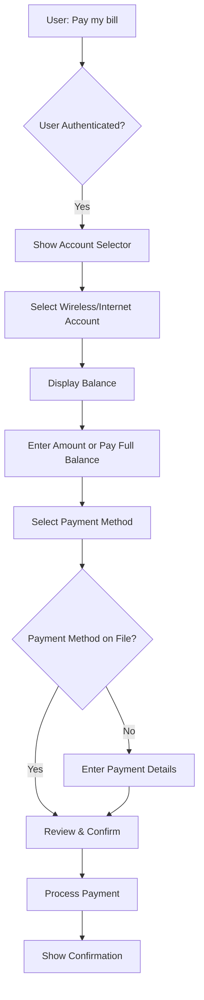
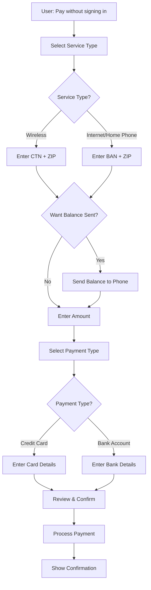

# AT&T Make a Payment Feature - Implementation Plan

## Overview

This document outlines the comprehensive plan for implementing the "Make a Payment" feature in the ChatGPT AT&T app. The feature supports two distinct user experiences: **Authenticated** and **Unauthenticated** payment flows.

### User Triggers
Users can initiate payments by saying:
- "I want to make a payment"
- "I want to pay my wireless bill"
- "I want to pay my internet bill"
- "Pay my AT&T bill"
- "Make a payment on my account"

---

## Architecture Overview

### Component Structure
```
src/att-payment/
├── index.jsx                    # Main app component with flow orchestration
├── AuthenticationScreen.jsx     # Login/authentication UI
├── ServiceSelector.jsx          # Service type selection (Wireless/Internet/etc.)
├── AuthenticatedPayment.jsx     # Authenticated payment flow
├── UnauthenticatedPayment.jsx   # Unauthenticated payment flow
├── AccountSelector.jsx          # Select wireless/internet account (authenticated)
├── AccountInfoForm.jsx          # Enter CTN/BAN + ZIP (unauthenticated)
├── BalanceDisplay.jsx           # Show current balance
├── AmountInput.jsx              # Enter payment amount
├── PaymentMethodSelector.jsx    # Select/change payment method
├── PaymentMethodForm.jsx        # Enter credit card or bank account details
├── ConfirmationScreen.jsx       # Payment confirmation/success
└── payment-data.json            # Mock data for development
```

---

## Flow Diagrams

### 1. Authenticated Payment Flow



### 2. Unauthenticated Payment Flow



---

## Component Specifications

### 1. Main Component (`index.jsx`)

**Purpose:** Orchestrate the payment flow and manage global state

**State Management:**
```javascript
{
  currentView: 'loading' | 'auth' | 'authenticated-payment' | 'unauthenticated-payment',
  isAuthenticated: boolean,
  selectedService: 'wireless' | 'internet' | 'prepaid' | 'uverse' | 'directv' | 'business',
  accountInfo: {
    accountNumber: string,
    accountType: string,
    balance: number,
  },
  paymentData: {
    amount: number,
    paymentMethod: object,
    accountIdentifier: string, // CTN or BAN
    zipCode: string,
  }
}
```

**Key Features:**
- Check for pre-authenticated state via `window.openai.toolInput`
- Route between authenticated and unauthenticated flows
- Handle widget state updates via `window.oai.widget.setState()`
- Support fullscreen mode

---

### 2. AuthenticationScreen Component

**Purpose:** Allow users to log in or choose "Pay without signing in"

**UI Elements:**
- AT&T logo
- "Select user ID to continue" section
- List of saved user IDs (if any)
- "Add user ID" button
- "Remove user ID" button
- **"Pay without signing in"** link (prominent)

**Props:**
```javascript
{
  onAuthenticated: (userData) => void,
  onGuestPayment: () => void,
}
```

---

### 3. ServiceSelector Component

**Purpose:** Select the type of service to pay for (unauthenticated flow)

**UI Elements (matching Image 4):**
- Header: "Pay without signing in"
- Subtitle: "Choose the service you want to pay:"
- Service cards:
  - AT&T Wireless (with signal icon)
  - Internet / Home Phone (with router icon)
  - AT&T Prepaid (with card icon)
  - U-verse® (with monitor icon)
  - DIRECTV (with logo)
  - Business account (with briefcase icon)
- "Not sure? Sign in to your account" link

**Props:**
```javascript
{
  onServiceSelect: (serviceType) => void,
}
```

---

### 4. AuthenticatedPayment Component

**Purpose:** Handle the authenticated payment flow

**Sub-components:**
- **AccountSelector:** Choose between wireless/internet accounts
  - Display account numbers and types
  - Show "Wireless" or "Internet" labels
  
- **BalanceDisplay:** Show current balance
  - Format: "Your balance is: $0.00"
  - "No payment is required" message if balance is $0
  
- **AmountInput:** Enter payment amount
  - Pre-filled with balance amount
  - "Split payments" link for installment options
  
- **PaymentMethodSelector:** Choose payment method
  - Display saved payment methods (card ending in XXXX)
  - "Change" link to add/edit payment methods
  - "Enable card on file" checkbox
  - "What is card on file?" info link

**State:**
```javascript
{
  selectedAccount: object,
  balance: number,
  amount: number,
  paymentMethod: object,
  paymentDate: Date,
}
```

---

### 5. UnauthenticatedPayment Component

**Purpose:** Handle the unauthenticated payment flow

**Sub-components:**
- **AccountInfoForm:** Enter account identification
  - For Wireless: "AT&T Wireless or account number" field
  - "Billing ZIP Code" field
  - Back button
  - Cancel/Continue buttons
  
- **BalanceRequest:** Option to send balance to phone
  - "Send balance to [phone number]" button
  - Skip option
  
- **AmountInput:** Enter payment amount (if balance not requested)
  
- **PaymentMethodForm:** Enter payment details
  - Payment type selector: Credit Card / Bank Account
  - Credit Card fields:
    - Card number
    - Expiration date
    - CVV
    - Cardholder name
    - Billing ZIP
  - Bank Account fields:
    - Account type (Checking/Savings)
    - Routing number
    - Account number
    - Account holder name

**State:**
```javascript
{
  accountIdentifier: string, // CTN or BAN
  zipCode: string,
  balanceRequested: boolean,
  balance: number,
  amount: number,
  paymentType: 'credit-card' | 'bank-account',
  paymentDetails: object,
}
```

---

### 6. ConfirmationScreen Component

**Purpose:** Display payment confirmation and next steps

**UI Elements:**
- Success checkmark icon
- "Payment Successful" message
- Payment details summary:
  - Account paid
  - Amount
  - Payment method
  - Confirmation number
  - Date/time
- "View receipt" button
- "Make another payment" button
- "Return to account" button (authenticated only)

---

## MCP Server Integration

### Tool Definition

Add to `att_server_python/main.py`:

```python
ATTWidget(
    identifier="att-make-payment",
    title="Make a Payment",
    template_uri="ui://widget/att-make-payment.html",
    invoking="Loading payment options",
    invoked="Payment options loaded",
    html=_modify_html_paths(_load_widget_html("att-payment")),
    response_text="Displayed AT&T payment options - pay your wireless or internet bill!",
)
```

### Tool Input Schema

```python
class ATTPaymentInput(BaseModel):
    payment_type: str = Field(
        ...,
        alias="paymentType",
        description="Type of payment: 'wireless', 'internet', 'prepaid', 'directv', 'uverse', or 'business'",
    )
    is_authenticated: bool = Field(
        False,
        alias="isAuthenticated",
        description="Whether the user is authenticated",
    )
    account_number: str | None = Field(
        None,
        alias="accountNumber",
        description="Account number or phone number (CTN) for unauthenticated payments",
    )
    zip_code: str | None = Field(
        None,
        alias="zipCode",
        description="Billing ZIP code for unauthenticated payments",
    )
```

### Tool Handler

```python
@mcp.tool()
async def att_make_payment(payment_type: str, is_authenticated: bool = False, 
                           account_number: str = None, zip_code: str = None) -> str:
    """
    Display AT&T payment interface for wireless or internet bills.
    
    Args:
        payment_type: Type of service to pay (wireless, internet, etc.)
        is_authenticated: Whether user is logged in
        account_number: Account/phone number (for unauthenticated)
        zip_code: Billing ZIP code (for unauthenticated)
    """
    widget = WIDGETS_BY_ID["att-make-payment"]
    
    # Build structured content
    structured_content = {
        "paymentType": payment_type,
        "isAuthenticated": is_authenticated,
    }
    
    if account_number:
        structured_content["accountNumber"] = account_number
    if zip_code:
        structured_content["zipCode"] = zip_code
    
    # Return widget with metadata
    return {
        "text": widget.response_text,
        "structuredContent": structured_content,
        "_meta": {
            "openai.com/widget": _embedded_widget_resource(widget).model_dump(mode="json"),
            "openai/outputTemplate": widget.template_uri,
        }
    }
```

---

## Mock Data Structure

### payment-data.json

```json
{
  "mockAccounts": {
    "authenticated": [
      {
        "accountId": "436156947789",
        "type": "wireless",
        "label": "Wireless",
        "balance": 0.00,
        "dueDate": "2025-12-11",
        "paymentMethods": [
          {
            "id": "pm-1",
            "type": "credit-card",
            "brand": "Apple Card",
            "last4": "4162",
            "default": true
          }
        ]
      },
      {
        "accountId": "338086151",
        "type": "internet",
        "label": "Internet",
        "balance": 89.99,
        "dueDate": "2025-11-20",
        "paymentMethods": []
      }
    ],
    "unauthenticated": {
      "4705959137": {
        "type": "wireless",
        "balance": 125.50,
        "zipCode": "30092"
      },
      "338086151": {
        "type": "internet",
        "balance": 89.99,
        "zipCode": "30092"
      }
    }
  },
  "serviceTypes": [
    {
      "id": "wireless",
      "name": "AT&T Wireless",
      "icon": "signal",
      "identifierLabel": "AT&T Wireless or account number",
      "identifierPlaceholder": "4705959137"
    },
    {
      "id": "internet",
      "name": "Internet / Home Phone",
      "icon": "router",
      "identifierLabel": "Billing Account Number (BAN)",
      "identifierPlaceholder": "338086151"
    },
    {
      "id": "prepaid",
      "name": "AT&T Prepaid",
      "icon": "credit-card"
    },
    {
      "id": "uverse",
      "name": "U-verse®",
      "icon": "monitor"
    },
    {
      "id": "directv",
      "name": "DIRECTV",
      "icon": "tv"
    },
    {
      "id": "business",
      "name": "Business account",
      "icon": "briefcase"
    }
  ],
  "paymentMethods": {
    "creditCard": {
      "brands": ["Visa", "Mastercard", "American Express", "Discover"],
      "fields": ["cardNumber", "expirationDate", "cvv", "cardholderName", "billingZip"]
    },
    "bankAccount": {
      "types": ["Checking", "Savings"],
      "fields": ["routingNumber", "accountNumber", "accountHolderName"]
    }
  }
}
```

---

## Key Features & User Experience

### Authenticated Experience
1. **Quick Account Selection:** Display all user accounts with balances
2. **Balance Visibility:** Prominent display of current balance
3. **Saved Payment Methods:** One-click payment with saved cards/accounts
4. **Payment Scheduling:** Option to schedule payment for a future date
5. **Split Payments:** Link to payment arrangement options
6. **Confirmation:** Immediate confirmation with receipt option

### Unauthenticated Experience
1. **Service Selection:** Clear visual cards for each service type
2. **Account Verification:** CTN/BAN + ZIP code validation
3. **Balance Request:** Option to send balance to mobile phone
4. **Flexible Payment:** Support both credit card and bank account
5. **Guest Checkout:** No account creation required
6. **Payment Confirmation:** Provide confirmation number for tracking

### Security & Validation
- **PCI Compliance:** Use secure iframe for credit card input
- **Input Validation:** Real-time validation for all form fields
- **ZIP Code Verification:** Match ZIP to account records
- **SSL/TLS:** All payment data transmitted securely
- **Confirmation Numbers:** Generate unique transaction IDs

---

## Implementation Phases

### Phase 1: Core Components (Weeks 1-2)
- [ ] Create main `index.jsx` with flow orchestration
- [ ] Build `AuthenticationScreen` component
- [ ] Build `ServiceSelector` component
- [ ] Create mock data structure in `payment-data.json`
- [ ] Implement basic routing between views

### Phase 2: Authenticated Flow (Week 3)
- [ ] Build `AuthenticatedPayment` component
- [ ] Implement `AccountSelector` sub-component
- [ ] Implement `BalanceDisplay` sub-component
- [ ] Implement `AmountInput` with validation
- [ ] Implement `PaymentMethodSelector`
- [ ] Connect to mock authenticated account data

### Phase 3: Unauthenticated Flow (Week 4)
- [ ] Build `UnauthenticatedPayment` component
- [ ] Implement `AccountInfoForm` with CTN/BAN input
- [ ] Implement balance request feature
- [ ] Build `PaymentMethodForm` for credit card and bank account
- [ ] Connect to mock unauthenticated lookup

### Phase 4: Payment Processing & Confirmation (Week 5)
- [ ] Build `ConfirmationScreen` component
- [ ] Implement payment submission logic (mock API)
- [ ] Add loading states and animations
- [ ] Implement error handling and validation
- [ ] Add success/failure messaging

### Phase 5: MCP Integration (Week 6)
- [ ] Add widget definition to `main.py`
- [ ] Create tool input schema and handler
- [ ] Test tool invocation from ChatGPT
- [ ] Handle pre-populated data from ChatGPT
- [ ] Test widget state synchronization

### Phase 6: Polish & Testing (Week 7)
- [ ] Add animations and transitions (Framer Motion)
- [ ] Implement responsive design for all screen sizes
- [ ] Add accessibility features (ARIA labels, keyboard navigation)
- [ ] Cross-browser testing
- [ ] Performance optimization
- [ ] User acceptance testing

### Phase 7: Production Readiness (Week 8)
- [ ] Replace mock data with real API integration
- [ ] Implement proper payment gateway integration
- [ ] Add analytics and logging
- [ ] Security audit
- [ ] Load testing
- [ ] Documentation and deployment

---

## Technical Considerations

### State Management
- Use React `useState` and `useEffect` hooks
- Leverage `window.openai.toolInput` for initial data
- Update ChatGPT via `window.oai.widget.setState()`
- Consider adding `useReducer` for complex payment flow state

### Styling
- Use Tailwind CSS (already configured)
- Follow AT&T brand guidelines for colors and typography
- Use Lucide React icons
- Implement Framer Motion for smooth transitions

### API Integration (Future)
```javascript
// Payment API endpoints to implement
const PAYMENT_API = {
  authenticatedBalance: '/api/payment/balance',
  unauthenticatedBalance: '/api/payment/guest/balance',
  validateAccount: '/api/payment/validate',
  submitPayment: '/api/payment/submit',
  sendBalanceSMS: '/api/payment/send-balance',
  getPaymentMethods: '/api/payment/methods',
};
```

### Error Handling
- Network errors
- Invalid account number/ZIP
- Insufficient balance
- Payment processing failures
- Timeout scenarios

### Accessibility
- Proper form labels and ARIA attributes
- Keyboard navigation support
- Screen reader compatibility
- High contrast mode support
- Focus management

---

## Success Metrics

### User Experience
- Average time to complete payment < 2 minutes
- Successful payment rate > 95%
- Error rate < 5%
- User satisfaction score > 4.5/5

### Technical
- Page load time < 2 seconds
- API response time < 500ms
- Widget render time < 1 second
- Zero security vulnerabilities

---

## Future Enhancements

1. **AutoPay Enrollment:** Allow users to set up recurring payments
2. **Payment History:** View past payment transactions
3. **Multiple Payments:** Pay multiple accounts in one session
4. **Payment Reminders:** SMS/email notifications for due dates
5. **Payment Plans:** Set up installment payment arrangements
6. **Wallet Integration:** Apple Pay, Google Pay support
7. **Biometric Authentication:** Face ID, Touch ID
8. **Voice Commands:** "Pay my bill with Apple Card"
9. **Receipt Management:** Download/email PDF receipts
10. **Multi-language Support:** Spanish, Chinese, etc.

---

## Dependencies

### NPM Packages (Already Available)
- `react` - UI framework
- `react-dom` - React rendering
- `framer-motion` - Animations
- `lucide-react` - Icons
- `react-datepicker` - Date selection (payment scheduling)
- `tailwindcss` - Styling

### New Dependencies (To Add)
```json
{
  "react-credit-cards": "^0.8.3",
  "card-validator": "^9.2.0",
  "react-input-mask": "^2.0.4"
}
```

---

## Files to Create

```
src/att-payment/
├── index.jsx                    (Main entry point - 300 lines)
├── AuthenticationScreen.jsx     (Login UI - 150 lines)
├── ServiceSelector.jsx          (Service selection - 120 lines)
├── AuthenticatedPayment.jsx     (Auth flow - 250 lines)
├── UnauthenticatedPayment.jsx   (Unauth flow - 300 lines)
├── AccountSelector.jsx          (Account picker - 100 lines)
├── AccountInfoForm.jsx          (CTN/BAN input - 150 lines)
├── BalanceDisplay.jsx           (Balance UI - 80 lines)
├── AmountInput.jsx              (Amount entry - 120 lines)
├── PaymentMethodSelector.jsx    (Method picker - 150 lines)
├── PaymentMethodForm.jsx        (Card/bank form - 250 lines)
├── ConfirmationScreen.jsx       (Success screen - 150 lines)
└── payment-data.json            (Mock data - 200 lines)
```

**Total Estimated Lines:** ~2,320 lines of code

---

## Next Steps

1. Review and approve this plan
2. Set up the `src/att-payment/` directory structure
3. Create mock data file
4. Begin Phase 1 implementation
5. Establish development and review cadence

---

## Questions to Resolve

1. **Real API Integration:** What payment gateway will be used? (Stripe, Authorize.net, etc.)
2. **Authentication:** How is user authentication handled? OAuth, SSO, custom?
3. **Balance Lookup:** What's the API for checking balance with CTN/BAN + ZIP?
4. **SMS Integration:** How to send balance to mobile phone?
5. **Security Requirements:** Any specific PCI-DSS compliance requirements?
6. **Testing Environment:** Is there a sandbox for testing payments?

---

**Document Version:** 1.0  
**Last Updated:** November 11, 2025  
**Author:** AI Assistant  
**Status:** Ready for Review
